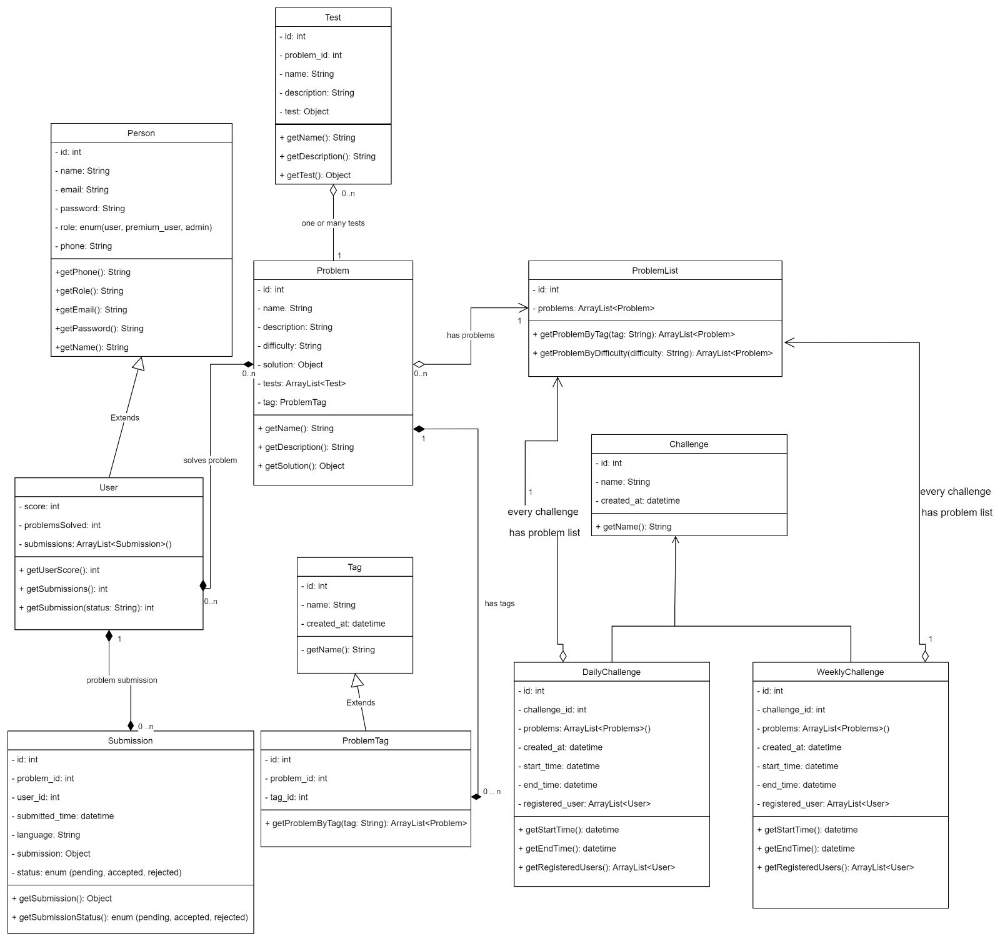

 <div align="center">
    
 </div>
 
 <H1 align="center">Leetify</H1>

# Overview
Leetify is an online coding platform that offers a diverse collection of challenges to help developers prepare for technical interviews. Covering various data structures and algorithms like arrays, linked lists, trees, and graphs, it enhances problem-solving skills for software engineers, developers, and students, making it an effective tool for technical interview preparation.

**Contributors: @Akhil Talashi | @Rutuja Ghate | @Snehashis Lenka**

**Project Demo: [Watch Here](https://www.youtube.com/watch?v=2YP86XvqiwE&t=8s)**

# Tech stack

 - React JS
 - Redux
 - NodeJS
 - MongoDB
 - Material UI
 - SCSS

# Key Features:

- **Authentication:** Sign up, log in/out
- **User Dashboard:** View stats(problems and submissions)
- **Admin Dashboard:** view stats(users, problems and submissions)
- **Problem Management:** Problems(CRUD), track submission status
- **Code Editor:** Monaco code editor, code compliation and execution
- **Deployment & Testing:** Production deployment, automated/manual testing, and bug fixing

# How to start

- Clone Repository ```git clone https://github.com/AkhilTalashi1995/LEETIFY.git```
  
- Run Backend
  - ```cd back-end``` 
  - ```npm install``` to install dependencies
  - ```npm start``` to start the backend server

- Run Frontend
  - ```cd front-end``` 
  - ```npm install``` to install dependencies
  - ```npm start``` to start the client

- Client application starts on ```http://localhost:3000```

- Server is available on ```http://localhost:8000```

# Object Model




